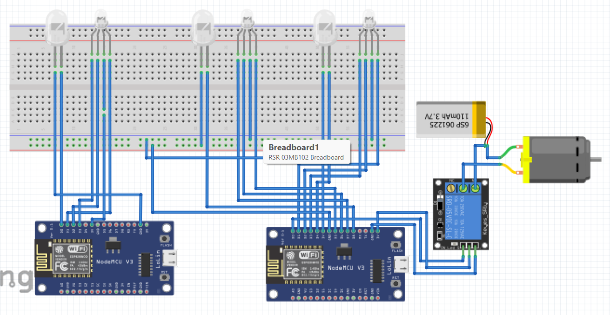

# Home Automation

This is a home automation project wherein I have developed a voice controlled system which controls the lights and fans of the house.

## How does it work?

This project is based on the communication between Node MCU, Blynk server, IFTTT and Google Assistant to perform the required task.

The command is given via Google Assistant which calls the IFTTT which further calls the Blynk server. This blynk server send the data to the Node MCU via Wifi data transfer. And now after receiving the data, the NOde MCU executes the command.

## Components Used

1. Node MCU - ESP8266 x2
2. RGB LED x3
3. LED x3
4. Breadboard
5. Battery
6. Relay Module
7. DC motor

### Circuit Diagram

